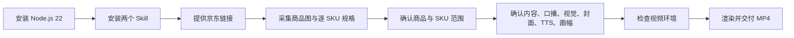

# yaokai-skills

面向 Codex 的京东商品采集与商品视频制作工作流。

> 安装命令可在 macOS、Linux、Windows 使用；当前视频渲染脚本与固定目录规范面向 Windows + Codex Desktop。

## 完整链路



## 1. 安装 Node.js 22

`npx skills` 依赖较新的 Node.js；推荐 Node.js 22。先确认当前版本：

```bash
node -v
```

若不是 `v22.x`，从 [Node.js 官网](https://nodejs.org/) 安装 Node.js 22，或使用版本管理器。

Windows 已安装 NVM for Windows 时：

```powershell
nvm install 22.23.1
nvm use 22.23.1
node -v
```

若报错 `node:util does not provide an export named styleText`，说明当前终端仍在使用旧 Node。执行 `where.exe node` 检查路径，切换到 Node 22 后关闭并重新打开终端。

## 2. 一键安装 Skill

在任意终端运行：

```bash
npx skills add https://github.com/TigerOfCountryYao/yaokai-skills --skill jd-product-collector jd-product-video --full-depth --global
```

安装完成后，在下一轮 Codex 对话即可使用 `$jd-product-collector` 和 `$jd-product-video`。同名 Skill 已存在时，安装器会停止，避免覆盖本地版本。

## 3. 采集商品资料

在 Codex 中提供京东短链接或商品链接，并说明需要采集产品图和规格。例如：

```text
使用 $jd-product-collector 采集这些京东链接的高清产品图、详情长图和每个可售 SKU 的规格。
```

采集 Skill 仅在用户明确授权时使用其 Chrome 登录态；不会读取 Cookie、订单、购物车、精确地址等账户信息，也不会进行购买操作。

输出统一存放在：

```text
C:\Users\<用户名>\Documents\JD商品采集\<采集任务ID>\
  jd_<SKU>\
    product-index.json
    products\<SKU>\
      product.json
      specifications.json
      images\...
```

## 4. 确认资料包

视频制作前必须确认商品与 SKU 范围：

- 多个京东链接：默认使用每个链接的当前默认 SKU。
- 单个京东链接：默认包含该链接下全部可访问 SKU。
- 不可售款式不补猜规格；只有确认的商品/SKU 才进入视频。

## 5. 制作商品视频

使用 `$jd-product-video`，它会在创作前逐项确认：

1. 内容模式：合集/推荐、横向对比或主题方案。
2. 口播结构与视觉规范。
3. 画幅：9:16、16:9 或 1:1。
4. 封面：Seedance 生图（需 Key）或“商品主图 + 用户选定标题”。
5. TTS：Edge TTS（免费）或 MiniMax（需用户提供当次 API Key）。

默认每个确认商品/SKU 使用一张动态商品卡，包含同步字幕；中间页面、音频和 HTML 源码仅保存在任务目录，用户交付物为 MP4。

## 6. 视频渲染环境

本地 HyperFrames 渲染需要：

- Node.js 22+
- FFmpeg（HyperFrames 的 MP4 编码依赖）
- `npx hyperframes`
- 如选择 Edge TTS：Python 与 `edge-tts` 包

视频 Skill 的环境检查脚本会在实际渲染前检查这些条件，并在缺失时停止：

```powershell
& "C:\Users\<用户名>\.codex\skills\jd-product-video\scripts\check_environment.ps1" -TtsMode "EdgeTTS"
```

## 7. 视频文件存放与交付

每次视频任务位于对应采集任务下，避免混用素材：

```text
C:\Users\<用户名>\Documents\JD商品采集\<采集任务ID>\
  videos\<视频任务ID>\
    assets\
    voice\
    project\
    output\final.mp4
```

完成质检后，仅交付 `final.mp4`。上传与发布不属于当前 Skill。

## Skill

- [`jd-product-collector`](skills/jd-product-collector)：通过用户明确授权的 Chrome 登录态采集京东商品图片与逐 SKU 规格。
- [`jd-product-video`](skills/jd-product-video)：将已确认资料包制作成带口播、字幕和动态商品卡的 MP4。